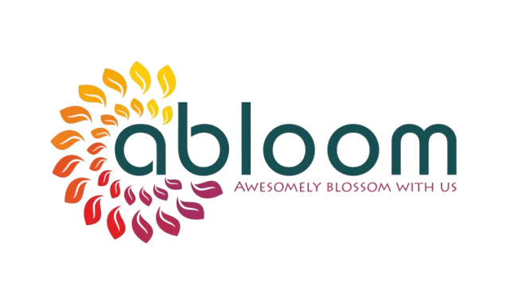

# Abloom — Hiranmayi



**Abloom** is a premium landing page for an exclusive nature-centric villa community located near Nashik, Maharashtra. The site showcases the project's vision, amenities, gallery, master plans, and contact information — all wrapped in a lush, immersive digital experience built with Next.js, Framer Motion, and GSAP.

> *Awesomely blossom with nature.*

---

## Sections

| Section | Description |
|---------|-------------|
| **Hero** | Full-screen video background with a particle-text reveal animation of "Abloom" |
| **Overview** | Scroll-triggered cards introducing the project's sanctuary, retreat, and oasis themes |
| **Unit Infrastructure** | Highlights ready infrastructure — vision, facilities, exclusivity, and location |
| **Gallery** | Draggable carousel showcasing project lifestyle imagery (clubhouse, greenery, dining, gym, etc.) |
| **Plans** | Interactive master-plan blueprints with hover-reveal details across sanctuary, seclusion, and schemes |
| **Get In Touch** | Contact form with background imagery and company branding |

## Tech Stack

| Technology | Purpose |
|------------|---------|
| **Next.js 16** (App Router, Turbopack) | Framework |
| **React 19** | UI library |
| **TypeScript** | Type safety |
| **Tailwind CSS 4** | Utility-first styling |
| **Framer Motion** | Declarative animations & gestures |
| **GSAP** | Scroll-triggered timeline animations |
| **shadcn/ui** (Radix primitives) | Accessible UI components |
| **Embla Carousel** | Gallery carousel |
| **Recharts** | Data visualizations |
| **React Hook Form** + **Zod** | Form handling & validation |
| **Sonner** | Toast notifications |
| **Vercel Analytics** | Visitor analytics |

## Screenshots

| Hero | Overview |
|------|----------|
|  |  |

| Gallery | Plans |
|---------|-------|
|  |  |

---

## Project Structure

```
abloom-hiranmayi/
├── app/
│   ├── globals.css          # Global styles
│   ├── icon.png             # Favicon
│   ├── layout.tsx           # Root layout (fonts, metadata, analytics)
│   └── page.tsx             # Home page (composes all sections)
├── public/
│   ├── fonts/               # Custom typefaces (PPPangaia, Radio Grotesk)
│   ├── images/
│   │   ├── abloom-logo.webp
│   │   ├── gallery-*.webp
│   │   ├── gallery_ref/     # Gallery carousel images
│   │   ├── plan/            # Master plan blueprints
│   │   └── unit_*.webp      # Unit infrastructure images
│   └── videos/
│       └── Hero-section.webm
├── src/
│   ├── components/
│   │   ├── layout/
│   │   │   ├── Footer.tsx
│   │   │   ├── Header.tsx
│   │   │   ├── MainLayout.tsx
│   │   │   └── ScrollRestoration.tsx
│   │   ├── sections/
│   │   │   ├── Gallery.tsx
│   │   │   ├── GetInTouch.tsx
│   │   │   ├── HeroScrollSequence.tsx
│   │   │   ├── Overview.tsx
│   │   │   ├── PlansSection.tsx
│   │   │   └── UnitInfrastructure.tsx
│   │   └── ui/
│   │       ├── menu-toggle-icon.tsx
│   │       └── particle-text-effect.tsx
│   ├── data/
│   │   └── abloom.ts        # Project content & metadata
│   └── lib/
│       ├── types.ts          # TypeScript interfaces
│       └── utils.ts          # Utility functions (cn, fadeUp, staggerContainer)
├── hooks/
│   └── use-scroll.ts
├── styles/
├── components.json           # shadcn/ui configuration
├── next.config.mjs
├── postcss.config.mjs
├── tsconfig.json
├── netlify.toml
└── package.json
```

## Getting Started

### Prerequisites

- **Node.js** ≥ 18
- **npm** or **pnpm**

### Install

```bash
npm install
```

### Development

```bash
npm run dev
```

Opens at [http://localhost:3000](http://localhost:3000) with Turbopack for fast HMR.

### Build

```bash
npm run build
```

Produces an optimized production build in `.next/`.

### Production Preview

```bash
npm run start
```

### Lint

```bash
npm run lint
```

## Deployment

The project is configured for **Netlify** via `netlify.toml` using `@netlify/plugin-nextjs`. Analytics are provided by **Vercel Analytics** (enabled in production).

## Fonts

- **PPPangaia** — Serif display family (Ultralight, Medium, Bold + italics), used for headings.
- **Radio Grotesk** — Sans-serif for body/UI text.
- **Instrument Serif** — Google Font fallback serif.

## Environment Variables

| Variable | Purpose |
|----------|---------|
| `NEXT_PUBLIC_ANALYTICS_ID` | Vercel Analytics identifier |

Create a `.env.local` file for local overrides (already in `.gitignore`).

## License

All rights reserved. This project is proprietary and not licensed for public use or distribution.
